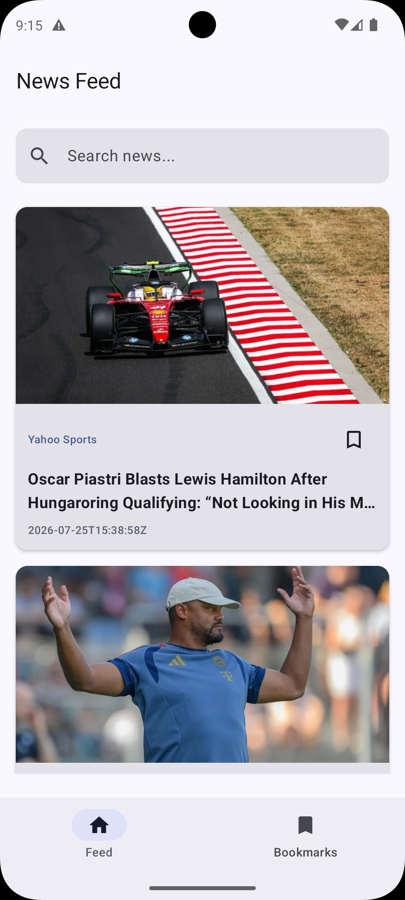

# 📰 GeekyTrust

[](https://kotlinlang.org/)
[](https://developer.android.com/)
[](https://developer.android.com/jetpack/compose)

**GeekyTrust** is a sleek, modern news application built to deliver the latest headlines with a seamless user experience. Leveraging the power of modern Android development, it offers real-time updates, offline support, and a beautiful Material 3 interface.

---

## ✨ Features

- 🚀 **Real-time News**: Stay updated with the latest headlines across various categories.
- 🔍 **Smart Search**: Find exactly what you're looking for with our optimized search engine.
- 📑 **Bookmarks**: Save your favorite articles for later reading with offline support.
- ♾️ **Infinite Scrolling**: Smooth, paginated news feed powered by Paging 3.
- 🎨 **Material 3 Design**: A modern, adaptive UI that looks great on any device.
- 🌓 **Dark Mode Support**: Easy on the eyes, no matter the time of day.

---

## 📸 Screenshots

| News Feed | Article Detail | Bookmarks |
| :---: | :---: | :---: |
|  |  |  |

> [!TIP]
> *Screenshots are stored in the `./screenshots` folder for easy maintenance.*

---

## 🛠 Tech Stack & Architecture

This project follows the **Clean Architecture** pattern and uses the **MVVM** (Model-View-ViewModel) architectural design.

### Core Libraries
- **UI**: [Jetpack Compose](https://developer.android.com/jetpack/compose) (Material 3)
- **Dependency Injection**: [Hilt](https://dagger.dev/hilt/)
- **Networking**: [Retrofit](https://square.github.io/retrofit/) & [OkHttp](https://square.github.io/okhttp/)
- **Local Database**: [Room](https://developer.android.com/training/data-storage/room)
- **Pagination**: [Paging 3](https://developer.android.com/topic/libraries/architecture/paging/v3-paged-data)
- **Image Loading**: [Coil](https://coil-kt.github.io/coil/)
- **Lifecycle**: [ViewModel](https://developer.android.com/topic/libraries/architecture/viewmodel), [Coroutines](https://kotlinlang.org/docs/coroutines-overview.html), [Flow](https://kotlinlang.org/docs/flow.html)

### Project Structure
- `data/`: Handles data operations (Remote API & Local DB).
- `di/`: Hilt modules for dependency injection.
- `presentation/`: Compose UI components and ViewModels.
- `utils/`: Helper classes and constants.

---

## 🚀 Getting Started

### Prerequisites
- Android Studio Iguana or newer.
- An API key from [GNews](https://gnews.io/).

### Setup
1. Clone the repository:
   ```bash
   git clone https://github.com/your-username/GeekyTrust.git
   ```
2. Open the project in Android Studio.
3. To run this project, add the API key of GNews (https://gnews.io/) in `local.properties` as:
   ```properties
   NEWS_API_KEY=YOUR_KEY
   ```
4. Build and run the app!

---

## 🤝 Contributing

Contributions are what make the open-source community such an amazing place to learn, inspire, and create. Any contributions you make are **greatly appreciated**.

---


Built with ❤️ by [Keshav Gupta](https://github.com/keshavgupta-mnnit)
